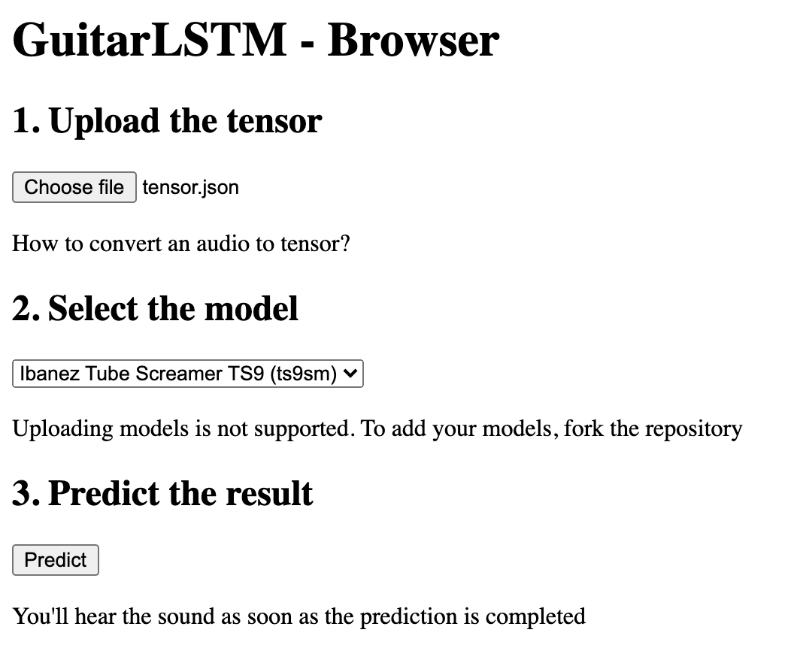

# GuitarLSTM Browser Experiment



The goal of the experiment was to enable loading GuitarML's [LSTM models](https://github.com/GuitarML/GuitarLSTM) in browsers or similiar environments (eg. WebViews)

The code is capable of predicting neural network's output based on a choosen pre-trained model and a user-specified tensor (imported as json) and allows users to listen to the result by utilizing [Web Audio API](https://developer.mozilla.org/en-US/docs/Web/API/Web_Audio_API)

A smaller (50-input) model of Ibanez Tube Screamer TS9 was used for better perfomance and smaller tensor file-size

Example tensor ([tensor.json](samples/tensor.json)), input audio ([in.wav](samples/in.wav)) and prediction result ([out_pred.wav](samples/out_pred.wav)) are available in the [samples](samples) directory

### Loading your own tensors

First, install [GuitarLSTM](https://github.com/GuitarML/GuitarLSTM) and all the dependencies

```
git clone https://github.com/GuitarML/GuitarLSTM
```

```
pip install -r requirements.txt
```

After training a model, run [savetensor.py](savetensor.py) script, specifying paths to your input audio, output tensor file and your model

```
savetensor.py data/in.wav test.json models/t9sm/t9sm.h5
```

Once finished, download the tensor file (test.json in our example) and load it in the web application using the "Upload" button

### Loading your own models

Install `tensorflowjs` pip package

```
pip install tensorflowjs
```

Locate and convert your model using `tensorflowjs_converter` utility

```
tensorflowjs_converter --input_format keras models/t9sm/t9sm.h5 models/t9sm/t9sm
```

Then download the resulting files (.json, .bin)
Specify the path to your `.json` file by changing this line in [index.html](index.html)

```js
const model = await tf.loadLayersModel('/models/ts9sm/model.json')
```

### Areas of improvement / Future work

- Make possible to work with .wav files natively instead of tensors
- Make possible to upload/specify custom models
- Add effects (with projects like [Tone.js](https://tonejs.github.io/))
